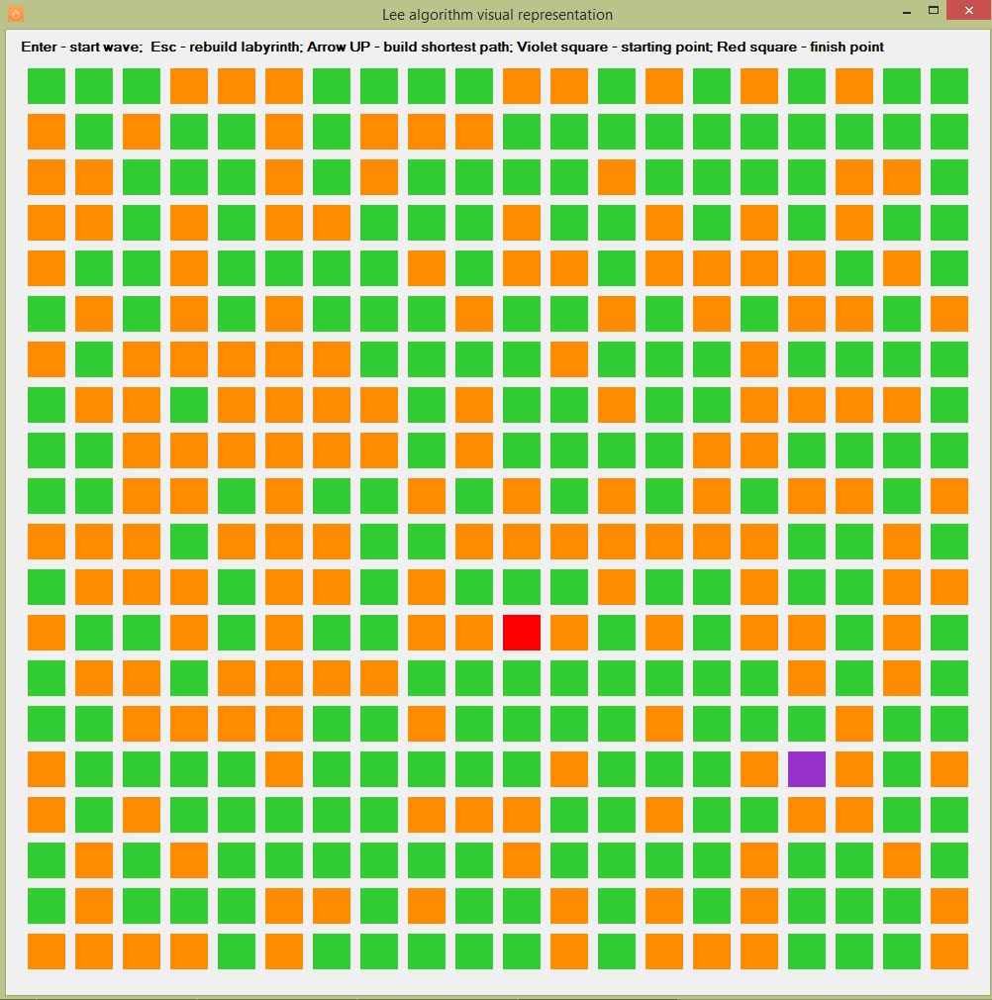
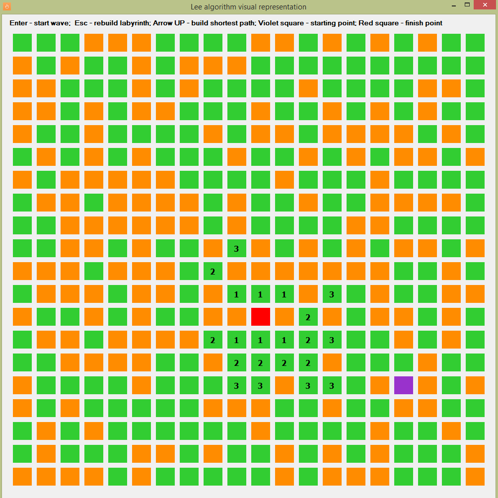
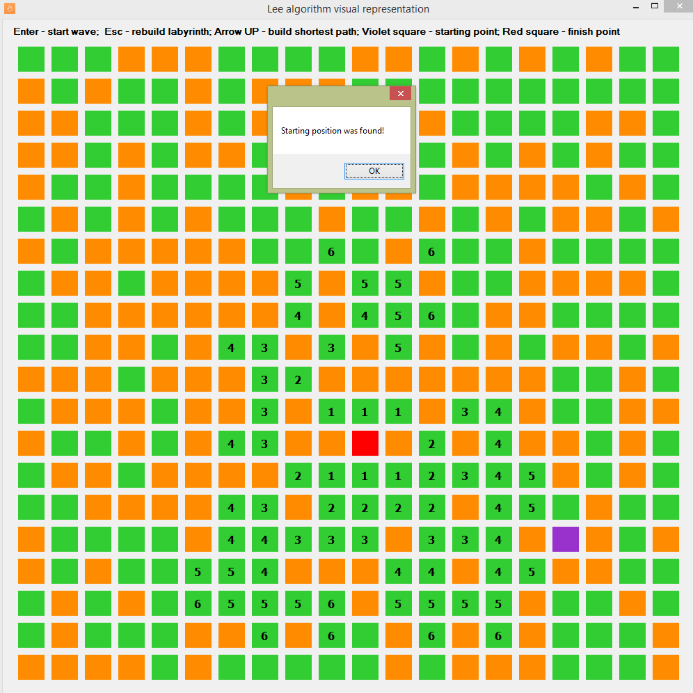
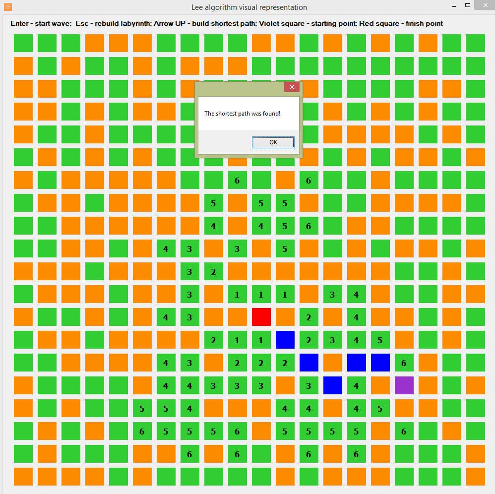

# Wave
> Lee algorithm visual representation

## Table of contents
* [General info](#general-info)
* [Screenshots](#screenshots)
* [Technologies](#technologies)
* [Contact](#contact)

## General info
Application written by me in 2015 as part of the study of the course of algorithms.
The Lee algorithm is one possible solution for maze routing problems based on Breadth-first search. It always gives an optimal solution, if one exists, but is slow and requires considerable memory.
1) Initialization
* Select start point, mark with 0
* i := 0
2) Wave expansion
 - REPEAT
* Mark all unlabeled neighbors of points marked with i with i+1
* i := i+1
 - UNTIL ((target reached) or (no points can be marked))
3) Backtrace
* go to the target point
 - REPEAT
* go to next node that has a lower mark than the current node
* add this node to path
 - UNTIL (start point reached)

## Screenshots

## Technologies
* C#
* Windows Forms

## Contact
Created by Anton Kozhanov [deal.for at gmail.com]
